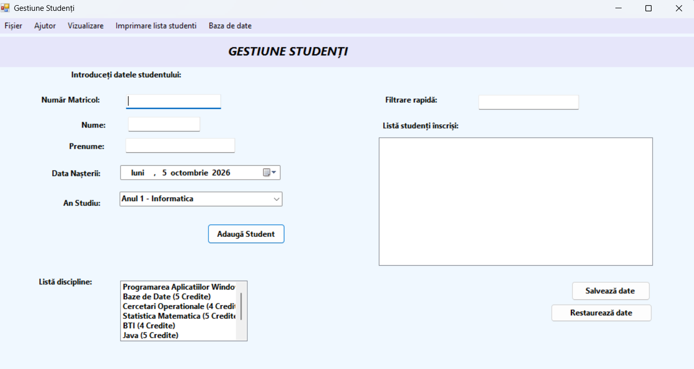
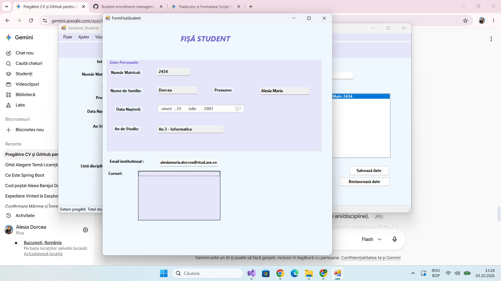
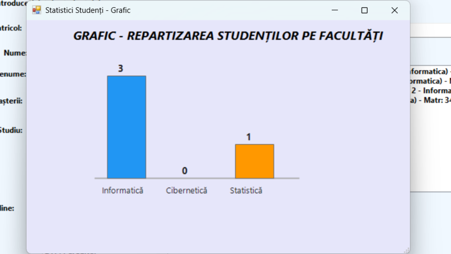

#  Student Enrollment Management System (C# / .NET Windows Forms)

A desktop application built in C# using .NET Windows Forms for managing university student enrollments, academic courses, and generating statistical visual graphics.

---

##  Application Screenshots

### Main Enrollment Dashboard

### Student File & Course Selection

### Statistical Analytics Chart

##  Key Features

- **Student Management:** Operations for student records (Matricol number, Name, Birth Date, Academic Year).
- **Course & Discipline Selection:** Interactive selection of academic disciplines (using drag and drop).
- **Data Persistence:** Save and restore student records to/from local storage files.
- **Data Validation & Error Handling:** Built-in validation rules for user input fields.
- **Custom Graphics & Visuals (`FormGrafic`):** Custom-drawn charts for statistical data visualization regarding enrolled students per specialization.
- **Printing & Exporting:** Features for printing student lists and exporting records.

---

##  Architecture & OOP Concepts

The application strictly follows Object-Oriented Programming (OOP) principles:
- **`Student.cs`**: Models student data, attributes, and custom methods.
- **`Disciplina.cs`**: Encapsulates course information (name, credit points).
- **`AnStudiu.cs`**: Manages academic year structures and enrollment conditions.
- **GUI Layer (`Form1`, `FormFisaStudent`, `FormGrafic`)**: Decoupled interface forms using standard WinForms controls (`ListView`, `ListBox`, `DateTimePicker`).

